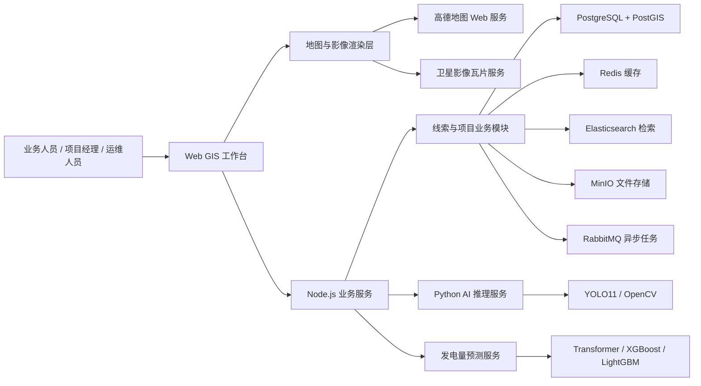
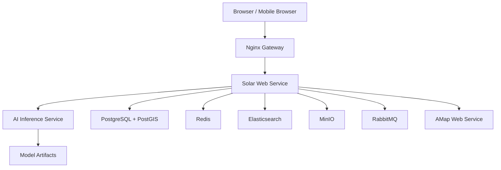
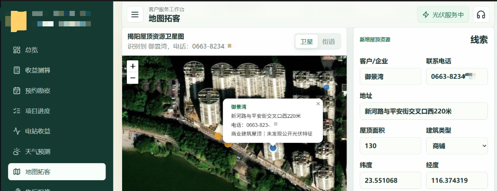
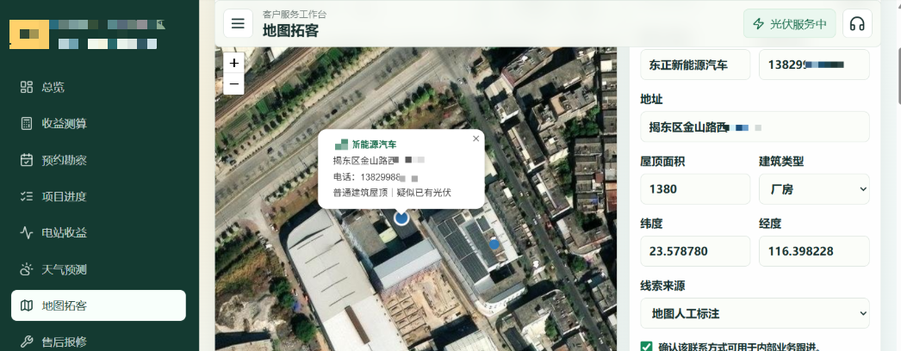
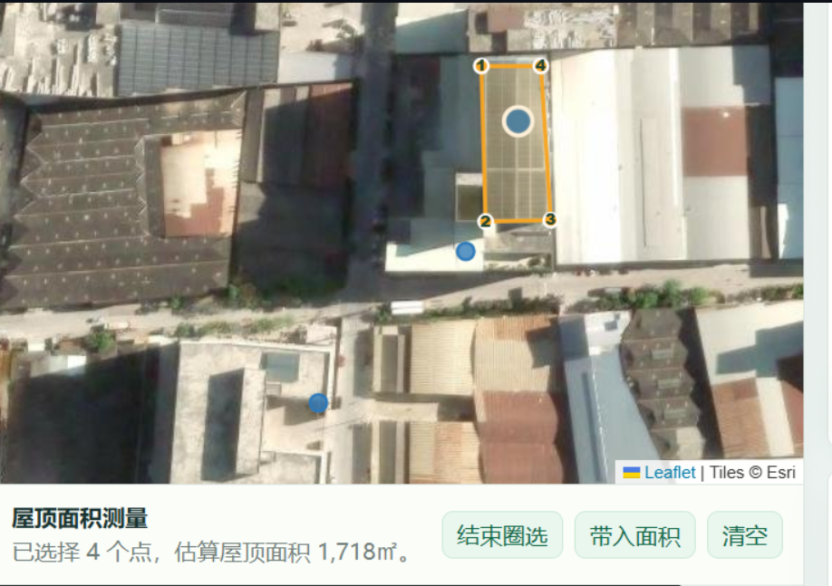

# 光伏新能源智能拓客与发电预测平台

面向分布式光伏业务场景的 GIS 拓客、屋顶资源识别、发电预测与项目运维管理平台。

## 项目概述

光伏新能源智能拓客与发电预测平台是一套面向分布式光伏企业的智能化业务系统，覆盖地图拓客、屋顶资源识别、脱敏线索管理、屋顶面积测量、收益测算、发电量预测、项目进度和售后服务等核心流程。

平台以 GIS 地图工作台为入口，结合高德地图 Web 服务、卫星影像瓦片、AI 图像识别和 Transformer 发电预测模型，帮助业务人员在目标区域内快速发现可开发屋顶资源，并形成从线索发现、方案评估到项目运营的业务闭环。

## 项目亮点

- **地图拓客一体化**：在同一工作台完成卫星图查看、街道图切换、地图选点、POI 识别、脱敏线索录入和屋顶资源分析。
- **AI 屋顶资源识别**：基于 YOLO11、OpenCV 和遥感影像处理能力，识别疑似光伏板、屋顶候选区域和可安装空间。
- **发电量预测**：基于 Transformer 时间序列模型，结合装机容量、天气、云量、降雨概率等特征预测未来发电量和收益趋势。
- **企业级架构拆分**：前端工作台、Node.js 业务服务、Python AI 推理服务、Nginx 网关、PostGIS 空间数据层和企业中间件分层设计。
- **业务闭环完整**：覆盖线索发现、业务跟进、预约勘察、方案测算、项目进度、电站收益和售后工单。
- **工程文档完整**：沉淀架构图、部署拓扑、功能截图、核心模块表格和关键代码片段，覆盖从业务建模到服务部署的主要环节。

## 技术栈

| 层级 | 技术 |
| --- | --- |
| 前端工作台 | HTML5、CSS3、JavaScript、Leaflet、ECharts、Canvas |
| 业务服务 | Node.js、REST API、JWT、Fetch API |
| AI 推理 | Python、FastAPI、Uvicorn、PyTorch、YOLO11、OpenCV、Transformer |
| 预测建模 | scikit-learn、XGBoost、LightGBM、时间序列特征工程 |
| GIS 与遥感 | 高德地图 Web 服务、卫星影像瓦片、GeoPandas、Rasterio、GDAL、PostGIS |
| 数据与中间件 | PostgreSQL、PostGIS、Redis、Elasticsearch、MinIO、RabbitMQ |
| 工程部署 | Docker、Docker Compose、Nginx |

## 核心模块

| 模块 | 功能范围 | 业务价值 |
| --- | --- | --- |
| GIS 地图拓客 | 地图选点、卫星图层、街道图层、POI 识别、线索点位管理 | 提升区域扫楼和资源发现效率 |
| 屋顶资源识别 | 屋顶候选区域、光伏板识别、屋顶性质判断、资源评分 | 减少人工查看影像成本，筛选高价值屋顶 |
| 屋顶面积测量 | 地图多边形圈选、面积估算、容量换算、组件数量测算 | 支撑初步报价和方案评估 |
| 线索管理 | 线索标识、地址层级、脱敏联系状态、建筑类型、跟进状态、线索来源 | 形成标准化业务跟进流程 |
| 收益测算 | 装机容量、年发电量、年收益、投资回收周期 | 辅助业务人员完成方案沟通 |
| 天气发电预测 | 天气特征、未来发电量、收益趋势、预测曲线 | 为收益评估和运维计划提供参考 |
| 项目进度 | 预约勘察、设计方案、施工节点、并网状态 | 提升项目交付透明度 |
| 售后服务 | 报修工单、工单状态、处理记录、附件资料 | 支持电站运营后的服务闭环 |

更完整的模块边界、输入输出、业务流程和技术落地说明见：[核心模块设计](docs/MODULES.md)。

## 系统架构

完整架构说明见：[系统架构设计](docs/ARCHITECTURE.md)



## 部署拓扑



## 功能截图

### 地图拓客工作台



### 工商业屋顶线索识别



### 屋顶资源识别与面积测量



## 商业价值

| 场景 | 平台能力 | 价值体现 |
| --- | --- | --- |
| 获客 | 地图点选、POI 匹配、屋顶识别、线索沉淀 | 降低人工扫图和扫街成本 |
| 评估 | 屋顶面积、建筑类型、疑似光伏、装机容量 | 提高资源价值判断速度 |
| 转化 | 收益测算、发电预测、跟进记录、预约勘察 | 帮助业务人员优先跟进高价值线索 |
| 交付 | 项目进度、施工节点、并网状态、资料归档 | 提升项目协同效率 |
| 运维 | 电站收益、发电预测、售后工单、附件管理 | 建立持续服务能力 |

## 仓库内容

```text
.
├── README.md
├── LICENSE
├── docs/
│   ├── ARCHITECTURE.md
│   ├── AI_FORECASTING.md
│   ├── MODULES.md
│   ├── SCREENSHOTS.md
│   └── screenshots/
└── snippets/
    ├── map-click-identify.js
    ├── ai-inference-service.py
    └── pv-forecast-transformer.py
```

## 架构能力展示点

| 能力 | 展示位置 |
| --- | --- |
| 服务拆分与边界设计 | `docs/ARCHITECTURE.md` |
| 业务模块拆分与闭环设计 | `docs/MODULES.md` |
| GIS 空间数据建模 | `docs/ARCHITECTURE.md`、`snippets/map-click-identify.js` |
| AI 推理服务化 | `docs/AI_FORECASTING.md`、`snippets/ai-inference-service.py` |
| 发电量时间序列预测 | `docs/AI_FORECASTING.md`、`snippets/pv-forecast-transformer.py` |
| 企业中间件选型 | `docs/ARCHITECTURE.md` |
| 安全与部署意识 | `README.md`、`LICENSE`、`.gitignore` |
