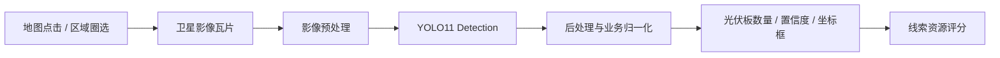
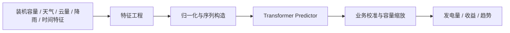
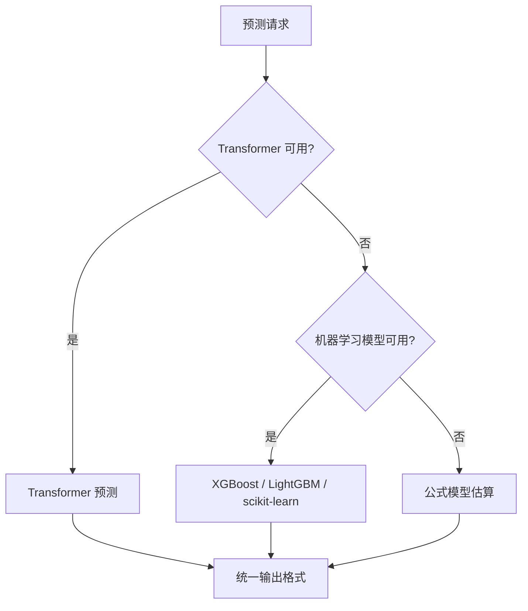
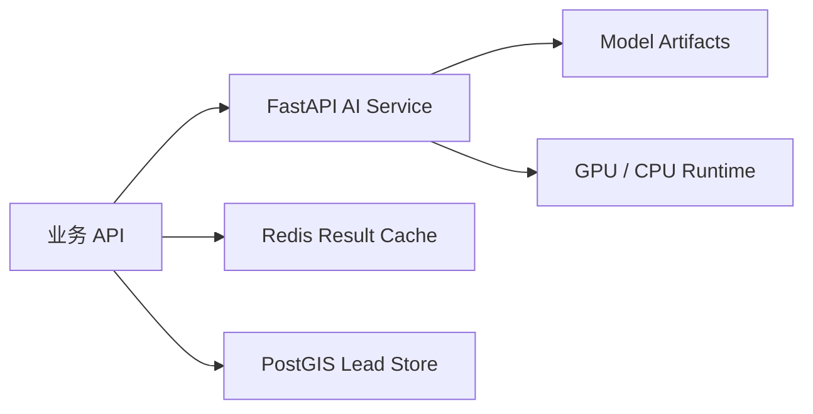

# AI 识别与发电预测

本文档描述平台中 AI 识别与发电预测模块的工程方案、模型链路和接口设计。

## 设计目标

平台的 AI 能力主要服务两个业务问题：

| 业务问题 | AI 能力 | 输出结果 |
| --- | --- | --- |
| 地图上哪些屋顶值得开发 | 屋顶资源识别、光伏板检测、屋顶面积估算 | 疑似屋顶、疑似已有光伏、资源评分、可安装面积 |
| 项目未来能发多少电 | 发电量时间序列预测、天气特征建模 | 未来发电量、收益趋势、预测曲线 |

AI 服务不直接决定最终业务结论，而是给业务 API 提供可解释的识别结果和预测结果，再由业务规则结合脱敏线索、建筑类型、联系状态和项目状态生成跟进优先级与复核状态。

## YOLO11 屋顶与光伏识别

YOLO11 用于从卫星影像、地图瓦片或上传图片中识别疑似光伏板和屋顶候选区域。业务服务会把地图点击位置、影像瓦片地址和缩放级别传给 AI 推理服务，AI 服务返回检测框、类别、置信度和数量统计。



### 输入数据

| 输入 | 说明 |
| --- | --- |
| 地图点击坐标 | 用于定位瓦片和匹配 POI 摘要 |
| 缩放级别 | 用于判断影像精度和瓦片范围 |
| 卫星影像瓦片 | 作为模型推理输入 |
| 上传图片 | 支持人工上传屋顶图或现场照片 |

### 输出字段

| 字段 | 说明 |
| --- | --- |
| `bbox` | 检测框坐标 |
| `label` | 检测类别，例如光伏板、屋顶候选区 |
| `confidence` | 模型置信度 |
| `pvCount` | 疑似光伏板数量 |
| `roofCount` | 疑似屋顶候选数量 |
| `engine` | 推理引擎标识 |

### 后处理策略

- 将模型类别归一化为业务可读结果，例如“疑似已有光伏”“普通建筑屋顶”“待人工复核”。
- 结合点击位置与检测框距离，判断当前点击点是否落在疑似光伏区域附近。
- 对置信度低、影像模糊、遮挡严重的结果标记为“需复核”，避免直接给出绝对判断。
- 将识别结果回写到线索评分模块，用于辅助排序。

## Transformer 发电量预测

Transformer 用于多变量时间序列预测，适合处理历史发电曲线、天气变化和未来趋势。相比纯公式估算，它通过时间特征和天气特征捕捉发电量的非线性变化。



### 特征设计

| 特征类型 | 示例 | 作用 |
| --- | --- | --- |
| 容量特征 | 装机容量、组件数量、系统效率 | 控制发电规模 |
| 天气特征 | 天气类型、云量、降雨概率、温度 | 反映短期发电波动 |
| 时间特征 | 日期、月份、小时、季节 | 反映日周期和季节变化 |
| 区域特征 | 区域编码、辐照水平、气象分区 | 反映地区日照差异 |
| 历史曲线 | 历史发电量、峰值功率、日累计电量 | 建模时间依赖 |

### 预测输出

| 输出 | 说明 |
| --- | --- |
| 未来发电量 | 按天或按时间片输出 kWh |
| 收益估算 | 根据电价和自用比例计算收益 |
| 峰值功率 | 估算日内峰值发电能力 |
| 趋势判断 | 判断未来多日发电趋势 |
| 降级标识 | 标识结果来自 Transformer、机器学习模型或公式模型 |

## 模型组合策略

平台采用“规则测算 + 传统机器学习 + Transformer”的组合方式，而不是只依赖单一模型。

| 模型 | 适合场景 | 优点 | 局限 |
| --- | --- | --- | --- |
| 公式模型 | 缺少实测电站样本时的初步收益测算 | 简单稳定，解释性强 | 对复杂天气变化适应弱 |
| scikit-learn | 小样本评分、基础回归预测 | 快速、轻量、便于调试 | 对复杂非线性关系表达有限 |
| XGBoost / LightGBM | 表格特征预测、线索优先级评分 | 工业界常用，效果稳定 | 对长周期时序依赖建模有限 |
| LSTM / GRU | 发电量时间序列预测 | 能处理时间依赖 | 长序列建模能力和并行效率有限 |
| Transformer | 多变量、长周期趋势预测 | 能建模长时间依赖和多特征关系 | 对数据质量、特征工程和部署资源要求更高 |

## 降级策略

AI 和预测模块以业务系统可用性为核心，链路中设计了多级降级：



该链路用于降低模型文件缺失、推理服务异常或依赖不可用对业务流程的影响。

## 评估指标

| 模块 | 指标 | 说明 |
| --- | --- | --- |
| 光伏板识别 | Precision / Recall / mAP | 评估检测准确率和漏检情况 |
| 屋顶候选识别 | IoU / Recall | 评估屋顶区域匹配程度 |
| 发电量预测 | MAE / RMSE / MAPE | 评估预测误差 |
| 业务线索评分 | Top-K 命中率 / 转化率 | 评估高价值线索排序效果 |

评估章节聚焦指标体系和工程验收方式，生产数据不进入代码仓库。

## 工程化部署



工程设计要点：

- AI 推理服务与业务 API 分离，便于独立扩容和模型升级。
- 模型权重通过制品仓库、对象存储或部署流水线注入，不进入源码仓库。
- 推理结果统一转成业务字段，前端展示“疑似已有光伏”“需人工复核”等业务结论。
- 对影像 URL 做白名单限制，防止 AI 服务被用于访问内网资源。
- 对预测结果做缓存，减少重复推理和外部天气接口调用。

## 模型制品管理

模型制品由部署环境注入，目录结构如下：

```text
models/
├── roof-pv.pt
└── pv-transformer-encoder-linear.pth
```

公开仓库不包含以下内容：

- 模型权重
- 训练数据集
- 业务数据明细
- 生产环境配置
- API Key 和部署密钥

这种方式更符合企业项目管理习惯：源码、数据、模型、配置分离，便于版本管理和权限控制。
