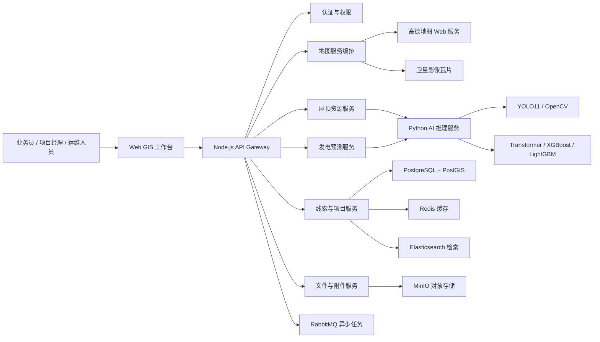
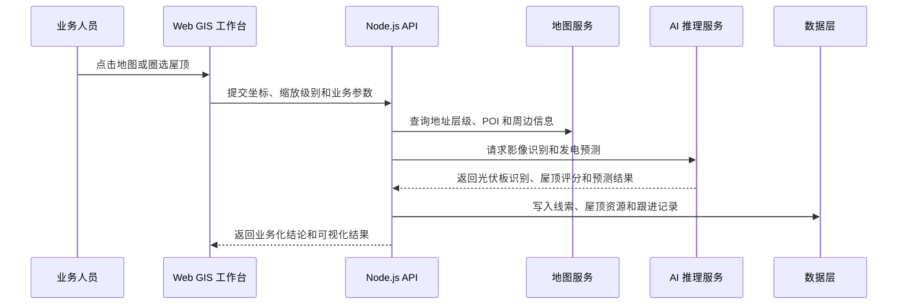
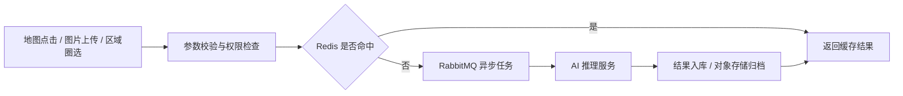

# 系统架构设计

## 架构定位

平台面向分布式光伏企业的拓客、方案测算、项目交付和售后运维场景，整体采用 **Web GIS 工作台 + 业务 API + AI 推理服务 + 空间数据层 + 企业中间件** 的分层架构。

设计重点不是把所有能力堆在一个页面里，而是把地图交互、脱敏线索、遥感识别、发电预测、空间查询和项目运营拆成边界清晰的服务模块，便于后续接入更多区域、更多模型和更多业务团队。

## 总体架构

## 服务边界

| 服务层 | 职责 | 设计价值 |
| --- | --- | --- |
| Web GIS 工作台 | 地图选点、图层切换、屋顶圈选、线索录入、图表展示 | 负责高频交互和业务可视化，不直接处理模型推理 |
| Node.js API Gateway | 认证鉴权、接口聚合、数据编排、第三方 API 封装 | 避免前端直接暴露地图 Key、模型服务和中间件地址 |
| 地图服务编排 | 逆地理编码、POI 查询、周边搜索、坐标转换 | 统一处理 WGS84 / GCJ02 / 瓦片坐标差异 |
| 线索与项目服务 | 脱敏线索、跟进状态、预约勘察、项目进度、售后工单 | 形成从获客到并网运维的业务闭环 |
| AI 推理服务 | 屋顶识别、光伏板检测、遥感分割、发电预测 | 与业务服务解耦，便于独立扩容和模型升级 |
| 数据与中间件层 | 空间查询、缓存、全文检索、对象存储、异步任务 | 支撑企业级数据量、搜索效率和任务可靠性 |

## 数据分层

| 数据类型 | 存储方案 | 说明 |
| --- | --- | --- |
| 线索与项目数据 | PostgreSQL | 存储线索、项目、工单、状态流转等结构化业务数据 |
| 空间坐标与屋顶边界 | PostGIS | 支持附近线索匹配、地图圈选、片区查询和空间索引 |
| 地图热点与预测结果 | Redis | 缓存高频地图查询、天气结果、AI 识别结果和发电预测结果 |
| 线索标识/地址层级/项目检索 | Elasticsearch | 支持线索标识、地址层级、项目名称等多条件检索 |
| 卫星截图/施工照片/附件 | MinIO | 存储图片、影像截图、工单附件等非结构化文件 |
| AI 任务与工单提醒 | RabbitMQ | 处理识别任务、预测任务、同步任务和提醒任务 |

## 核心业务流程

## AI 任务处理链路

## 安全设计

| 风险点 | 设计措施 |
| --- | --- |
| 业务接口被直接访问 | API 层统一接入 JWT 鉴权，按角色区分管理、业务、只读权限 |
| 地图 Key 泄露 | 第三方地图 API 由服务端代理封装，前端不直接持有敏感 Key |
| 文件上传风险 | 限制文件大小、MIME 类型和图片头，上传文件进入对象存储 |
| AI 图片 URL SSRF | AI 服务只允许访问白名单影像域名，阻断内网 IP、回环地址和云元数据地址 |
| 数据泄露 | 环境变量、模型权重、业务数据明细和敏感业务附件不进入公开仓库 |
| 服务暴露 | 生产环境只暴露 Nginx 网关，数据库和中间件走私有网络 |

## 性能与扩展

| 场景 | 扩展方式 |
| --- | --- |
| 地图点位加载慢 | Redis 缓存热点区域、PostGIS 空间索引、按视野范围分页加载 |
| POI 与地址查询频繁 | 服务端缓存高德查询结果，减少重复请求和配额消耗 |
| AI 识别耗时 | AI 服务独立部署，支持 GPU 节点横向扩容和任务队列削峰 |
| 发电预测请求多 | 预测结果按容量、区域、日期和天气特征缓存 |
| 文件和影像增长 | 图片、截图和敏感业务附件进入 MinIO，业务数据库只保存元数据 |
| 搜索数据增长 | Elasticsearch 独立维护索引，支持线索、地址层级、项目多字段检索 |

## 可观测性与运维

- 健康检查：Web 服务、AI 服务、数据库、中间件分别提供状态检查。
- 日志分层：接口访问日志、AI 推理日志、异步任务日志、业务事件日志独立记录。
- 任务追踪：AI 识别、天气同步、预测计算和工单提醒可通过任务 ID 追踪。
- 降级策略：地图 API、AI 模型、预测模型不可用时返回可解释的降级结果。
- 部署隔离：Web、AI、数据库、中间件通过容器拆分，便于单独升级和回滚。

## 架构亮点

- 用 PostGIS 处理空间数据，而不是把坐标当普通字段存储。
- 用 RabbitMQ 承接 AI 识别、预测、工单提醒等耗时任务。
- 用 Redis 缓存地图、天气、预测和识别结果，减少外部 API 调用。
- 用 MinIO 管理影像和附件，避免大文件直接进入业务数据库。
- AI 推理服务独立于业务 API，支持模型升级和 GPU 资源扩展。
