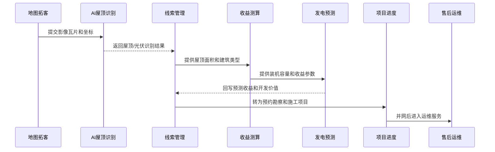

# 核心模块设计

本文档说明平台的业务模块拆分、模块边界、关键技术和数据流转方式。公开仓库仅展示模块设计和脱敏流程，不包含完整业务源码、业务数据明细和模型权重。

## 模块总览

平台围绕光伏企业“找屋顶、判价值、算收益、跟项目、做运维”的业务流程设计。

| 模块 | 业务目标 | 关键技术 | 输出结果 |
| --- | --- | --- | --- |
| GIS 地图拓客 | 在地图上发现可开发屋顶和候选线索 | Leaflet、高德地图 Web 服务、POI、逆地理编码、PostGIS | 地图点位、POI 摘要、候选线索 |
| AI 屋顶识别 | 判断屋顶是否已有光伏、是否具备开发价值 | YOLO11、OpenCV、卫星影像瓦片、图像后处理 | 光伏板识别结果、屋顶候选区域、置信度 |
| 屋顶面积测量 | 估算屋顶面积、装机容量和组件数量 | Leaflet Polygon、Canvas、坐标换算、面积估算 | 屋顶面积、预计容量、组件数量 |
| 收益测算 | 给业务人员提供报价和收益参考 | 公式模型、容量换算、ECharts 可视化 | 年发电量、年收益、回收周期 |
| 发电量预测 | 结合天气和容量预测未来发电趋势 | Transformer、XGBoost、LightGBM、天气特征工程 | 未来发电量、收益趋势、预测曲线 |
| 线索管理 | 管理线索标识、脱敏联系状态、区域信息、跟进状态和优先级 | Node.js API、PostgreSQL、PostGIS、Elasticsearch | 线索列表、评分排序、跟进记录 |
| 项目进度管理 | 跟踪勘察、设计、施工、并网等节点 | 状态流转、业务事件、RabbitMQ | 项目状态、施工节点、任务提醒 |
| 售后运维 | 管理报修、巡检、附件和运维记录 | MinIO、工单流转、异步提醒 | 售后工单、附件归档、处理记录 |

## 业务闭环

这个流程的重点是把“地图上的一个屋顶”逐步转成“可跟进线索”和“可落地项目”，避免线索散落在表格、地图截图和聊天记录里。

## GIS 地图拓客模块

### 业务目标

让业务人员通过地图快速筛选区域内的工商业屋顶、商铺、自建房和园区资源，并关联 POI 摘要、地址层级、脱敏联系状态和屋顶资源。

### 核心能力

- 卫星图、街道图和业务点位图层切换。
- 地图点击识别地址、POI 和周边企业。
- 支持脱敏线索点位、屋顶资源点位和疑似光伏点位展示。
- 支持地图圈选、附近搜索和区域线索聚合。

### 关键技术

| 技术 | 用途 |
| --- | --- |
| Leaflet | 地图渲染、点位标注、图层切换、圈选交互 |
| 高德地图 Web 服务 | 逆地理编码、POI 搜索、周边搜索、地址解析 |
| PostGIS | 管理线索坐标、屋顶边界和附近查询 |
| Redis | 缓存热点区域地图识别结果 |

### 输入与输出

| 输入 | 输出 |
| --- | --- |
| 地图坐标、缩放级别、关键词、地图图层 | 地址层级、POI 摘要、脱敏联系状态、候选屋顶点位 |

## AI 屋顶识别模块

### 业务目标

从卫星影像中辅助判断屋顶是否已经安装光伏、是否存在可开发空间，并把识别结果回写到候选线索。

### 核心能力

- 识别疑似光伏板区域。
- 识别普通建筑屋顶和工商业屋顶候选区域。
- 输出检测框、置信度和数量统计。
- 根据影像质量和置信度标记“需人工复核”。

### 关键技术

| 技术 | 用途 |
| --- | --- |
| YOLO11 | 光伏板和屋顶候选区域检测 |
| OpenCV | 图像预处理、边缘、颜色和矩形特征辅助判断 |
| FastAPI | 提供独立 AI 推理接口 |
| Redis / RabbitMQ | 缓存识别结果、承接异步识别任务 |

### 输入与输出

| 输入 | 输出 |
| --- | --- |
| 卫星影像瓦片、上传图片、地图点击坐标 | bbox、label、confidence、pvCount、roofCount、业务化判断 |

## 屋顶面积测量模块

### 业务目标

让业务人员在地图上圈选屋顶边界，快速估算可安装面积、装机容量和组件数量。

### 核心能力

- 地图多边形圈选。
- 屋顶面积估算。
- 装机容量换算。
- 组件数量测算。
- 与收益测算和方案生成联动。

### 关键技术

| 技术 | 用途 |
| --- | --- |
| Leaflet Polygon | 屋顶边界圈选 |
| Canvas | 图片标注和识别框展示 |
| 坐标换算 | 地图坐标、瓦片坐标和像素坐标之间转换 |
| 业务规则 | 面积到容量、容量到组件数量换算 |

### 输入与输出

| 输入 | 输出 |
| --- | --- |
| 屋顶多边形点位、建筑类型、组件参数 | 屋顶面积、预计容量、组件数量、初步方案参数 |

## 收益测算模块

### 业务目标

根据屋顶面积和装机容量，提供初步收益测算和投资回收周期参考。

### 核心能力

- 计算装机容量、年发电量、年收益。
- 支持不同屋顶类型和用电场景。
- 输出收益图表和方案摘要。
- 与候选线索、方案报价和项目进度联动。

### 关键技术

| 技术 | 用途 |
| --- | --- |
| JavaScript 规则模型 | 快速完成容量和收益估算 |
| ECharts | 展示收益趋势和发电趋势 |
| Node.js API | 封装测算参数和结果 |

### 输入与输出

| 输入 | 输出 |
| --- | --- |
| 屋顶面积、屋顶类型、电价、系统效率、自用比例 | 装机容量、年发电量、收益、回收周期 |

## 发电量预测模块

### 业务目标

结合天气、云量、降雨概率、装机容量和时间特征，预测未来发电量和收益趋势。

### 核心能力

- 未来多日发电量预测。
- 收益趋势预测。
- 天气特征建模。
- 预测结果缓存。
- 模型不可用时降级到公式模型。

### 关键技术

| 技术 | 用途 |
| --- | --- |
| Transformer | 多变量时间序列预测 |
| XGBoost / LightGBM | 表格特征预测和基线模型 |
| scikit-learn | 轻量级回归和特征处理 |
| Redis | 缓存预测结果，减少重复推理 |

### 输入与输出

| 输入 | 输出 |
| --- | --- |
| 装机容量、天气、云量、降雨概率、温度、时间特征 | 未来发电量、峰值功率、收益趋势、模型来源 |

## 线索管理模块

### 业务目标

沉淀业务人员发现的候选线索，并根据屋顶资源、联系状态、建筑类型和开发价值进行排序。

### 核心能力

- 线索标识、地址层级、脱敏联系状态、屋顶面积和建筑类型管理。
- 线索来源、跟进状态和业务员记录。
- 线索评分和优先级排序。
- 地图点位和线索列表联动。
- 支持搜索和附近匹配。

### 关键技术

| 技术 | 用途 |
| --- | --- |
| PostgreSQL | 存储线索和项目结构化数据 |
| PostGIS | 处理线索点位、屋顶边界和空间查询 |
| Elasticsearch | 支持线索标识、地址层级、项目名称快速检索 |
| JWT | 控制业务数据访问权限 |

### 输入与输出

| 输入 | 输出 |
| --- | --- |
| 地图识别结果、人工录入、导入线索、AI 识别结果 | 线索池、资源画像、评分等级、跟进优先级 |

## 项目进度管理模块

### 业务目标

跟踪线索从预约勘察到设计、施工、并网的项目状态，减少业务交接和施工协同成本。

### 核心能力

- 预约勘察管理。
- 设计方案状态管理。
- 施工节点跟踪。
- 并网状态记录。
- 业务事件和任务提醒。

### 关键技术

| 技术 | 用途 |
| --- | --- |
| 状态机设计 | 管理项目节点流转 |
| RabbitMQ | 处理提醒、同步和异步任务 |
| MinIO | 存储勘察照片、施工照片和敏感业务附件 |

### 输入与输出

| 输入 | 输出 |
| --- | --- |
| 脱敏线索、勘察记录、施工节点、附件资料 | 项目进度、任务提醒、交付记录 |

## 售后运维模块

### 业务目标

项目并网后继续管理电站收益、服务报修、巡检记录和售后工单。

### 核心能力

- 售后报修工单。
- 工单等级和处理状态。
- 运维附件归档。
- 电站收益和预测结果查看。
- 形成项目全生命周期记录。

### 关键技术

| 技术 | 用途 |
| --- | --- |
| MinIO | 保存报修图片、巡检照片和附件 |
| RabbitMQ | 工单提醒和异步通知 |
| ECharts | 展示电站收益和趋势 |
| PostgreSQL | 管理工单和服务记录 |

### 输入与输出

| 输入 | 输出 |
| --- | --- |
| 报修类型、脱敏联系信息、故障描述、附件资料 | 工单记录、处理状态、服务历史 |

## 模块协作关系

## 模块设计亮点

- 地图拓客不是单独页面，而是线索发现入口。
- AI 识别结果不直接替代业务判断，而是进入线索评分和人工复核流程。
- 发电预测支持模型降级，避免 AI 服务不可用时影响业务流程。
- 空间数据进入 PostGIS，支持附近匹配和地图圈选查询。
- 图片和附件进入 MinIO，业务数据库只保存元数据。
- 工单提醒、AI 识别、天气同步等耗时任务通过 RabbitMQ 异步处理。
